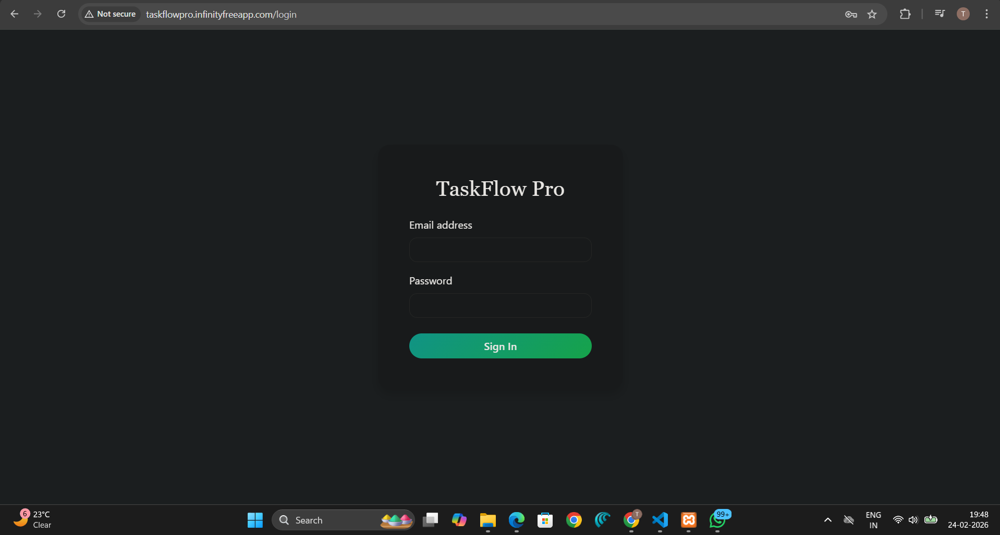
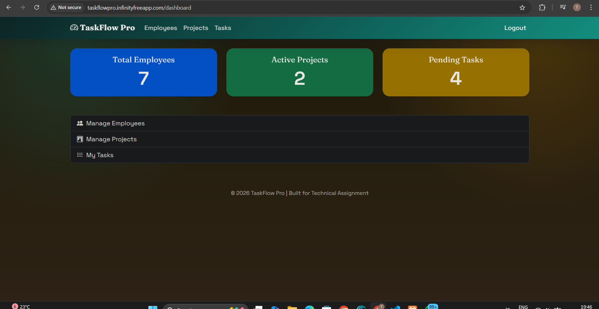
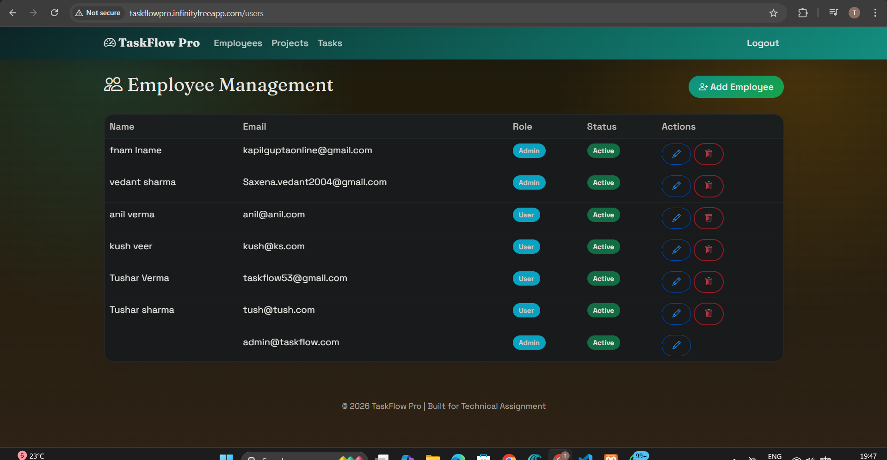
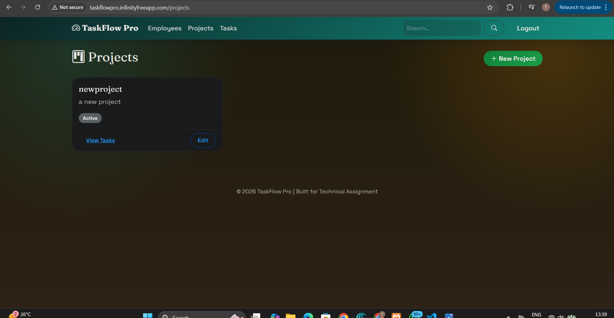
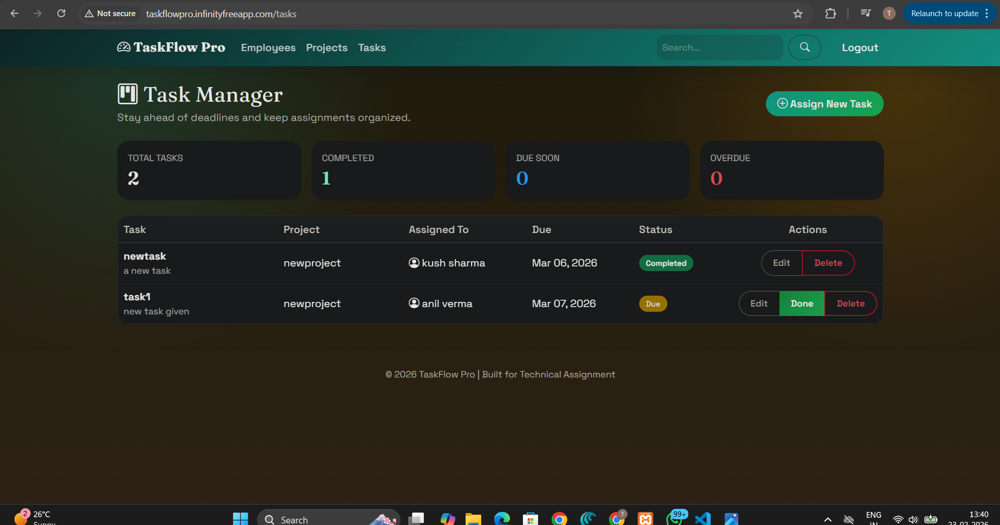

# TaskFlow Pro - Mini ERP & Task Management System

## Tech Stack
- **Language:** PHP 8.x (OOP with strict types)
- **Database:** MySQL 5.7+
- **Frontend:** HTML5, CSS3, Bootstrap 5.3.3
- **Icons:** Bootstrap Icons 1.11.3
- **Server:** Apache (XAMPP/LAMPP Stack)
- **Authentication:** BCrypt password hashing, PDO prepared statements

## Features Implemented
1. **Authentication & Security**
   - Email/login-based authentication with BCrypt hashing
   - Session-based authorization with middleware guards
   - Login activity tracking (user_login_records table)
   - Secure logout functionality

2. **Role-Based Access Control (RBAC)**
   - Admin and User roles with permission scaffolding
   - Role-aware UI (Employees link visible to Admin only)
   - Middleware-protected dashboard endpoints

3. **Employee Management**
   - Admin-only create, read, update, and soft-delete workflows
   - Bootstrap modal forms for Add/Edit operations
   - Real-time validation and error handling
   - Login activity logging per user

4. **Project Management**
   - Admin create project via modal
   - Admin edit projects in-place with full modals
   - Project status tracking (Active/Inactive)
   - Description support for each project

5. **Task Management**
   - Admin assign tasks to employees with projects and due dates
   - Task status tracking (Pending, In Progress, Completed)
   - Task analytics dashboard (total, completed, overdue, due-soon counts)
   - Role-specific task views (admin sees all, users see assigned)
   - Task edit modals for admins with status/assignee updates
   - Mark Done action for assigned users and admins

6. **User Interface**
   - Responsive Bootstrap 5 layout
   - Shared header/footer components with search bar
   - Card layouts for projects and dashboard stats
   - Responsive table for task listings
   - Admin action buttons (Edit, Done, etc.)
   - Role-aware navigation

## Setup Instructions
1. Configure database in config/db.php
2. Import database/schema.sql into your MySQL database
3. Start Apache and MySQL
4. Open the app at http://taskflowpro.infinityfreeapp.com

## Test Credentials
- Admin
  - email: admin@taskflow.com
  - Password: admin123
- User
  - email: taskflow53@gmail.com
  - password: tush@123

## API Endpoints
- GET /api/users
- GET /api/users/{id}
- POST /api/users
- PUT /api/users/{id}
- DELETE /api/users/{id}
- GET /api/projects
- GET /api/projects/{id}
- POST /api/projects
- PUT /api/projects/{id}
- DELETE /api/projects/{id}
- GET /api/tasks
- GET /api/tasks/{id}
- POST /api/tasks
- PUT /api/tasks/{id}

## Known Limitations
- RBAC is enforced in the UI; some API actions still use admin-only checks instead of per-right evaluation.
- No password reset or email verification flow.
- No pagination or server-side filtering for large user/project/task lists.
- No file uploads or task attachments.
- No email or in-app notifications for assignments and due dates.
- Mobile layout is responsive and functional, but only basic cross-device testing has been performed.

## Screenshots

### Login Page

- Email/login input field
- Password field with secure handling
- Bootstrap alert for invalid credentials

### Dashboard

- Quick stats cards (Total Projects, Active Tasks, Team Members)
- Role-aware navigation (Admin sees Employees link)
- Responsive grid layout

### Employee Management

- Table with employee list
- Add/Edit modals with validation
- Status indicators (Active/Inactive)
- Action buttons (Edit, Deactivate)

### Project Board

- Card layout for projects
- Admin Edit button per project
- Status badge (Active/Inactive)
- Create New Project modal

### Task Manager

- Analytics cards (Total, Completed, Due Soon, Overdue)
- Responsive table with task details
- Status badges with color coding
- Admin Edit and Done buttons
- Assign New Task modal
- Role-specific view (admin sees all, users see assigned)